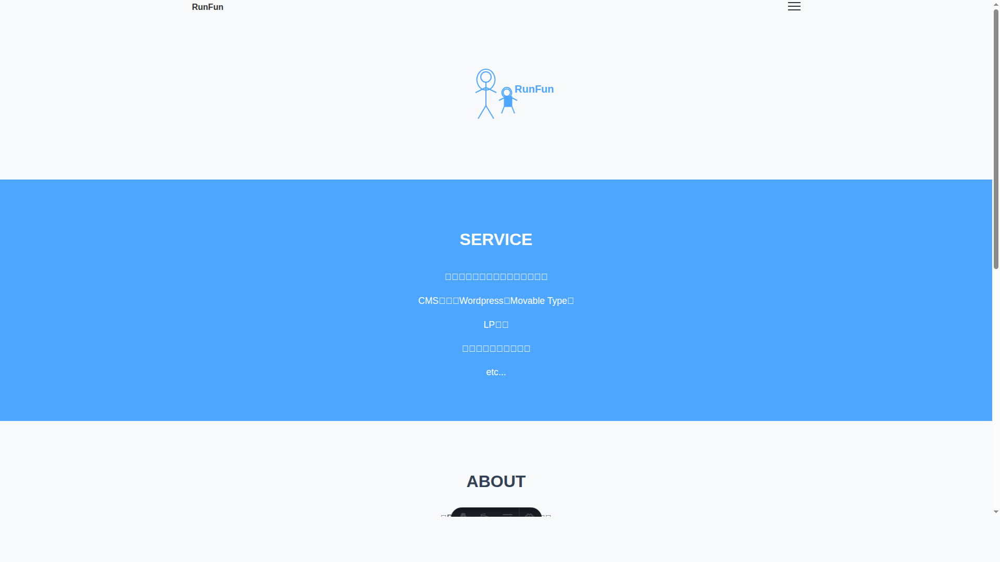
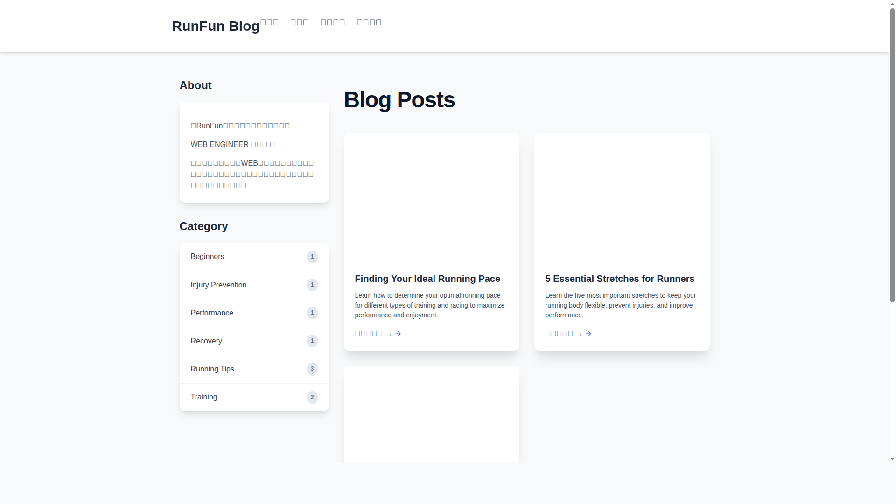

# ブログページのスクリーンショット

このファイルには、現在のブログページのキャプチャ画像が含まれています。

## スクリーンショット一覧

### ホームページ

**ファイル名:** `homepage-screenshot.png`
**URL:** `http://localhost:4321/`
**説明:** ブログサイトのメインページ（トップページ）のスクリーンショット

### ブログ一覧ページ

**ファイル名:** `blog-page-screenshot.png`
**URL:** `http://localhost:4321/blog`
**説明:** ブログ記事の一覧が表示されるメインのブログページのスクリーンショット

## 技術詳細

- **撮影日時:** 2025年6月5日
- **ブラウザ:** Google Chrome (Headless)
- **解像度:** 1920x1080
- **フレームワーク:** Astro v5.8.0

## ブログの現状

現在のブログには以下の記事が含まれています：
- Essential Stretches for Runners
- Finding Your Ideal Running Pace  
- Getting Started with Running

ブログページには以下の機能が実装されています：
- レスポンシブデザイン
- サイドバー（About セクションとカテゴリ）
- ブログ記事のプレビューカード
- 多言語対応（日本語/英語）